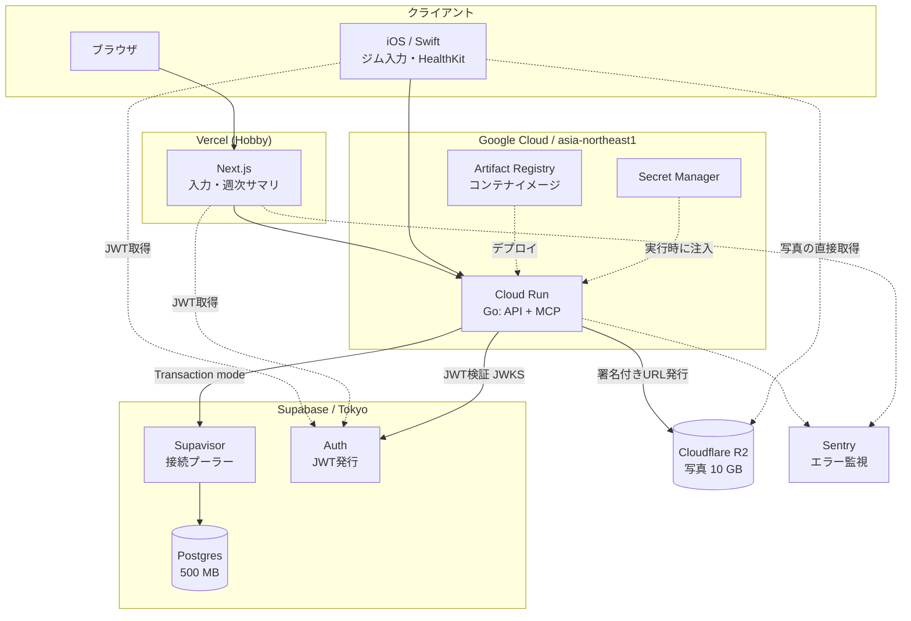
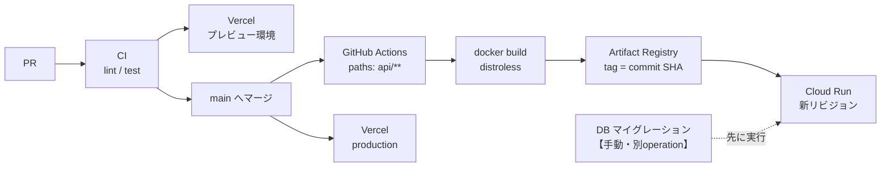
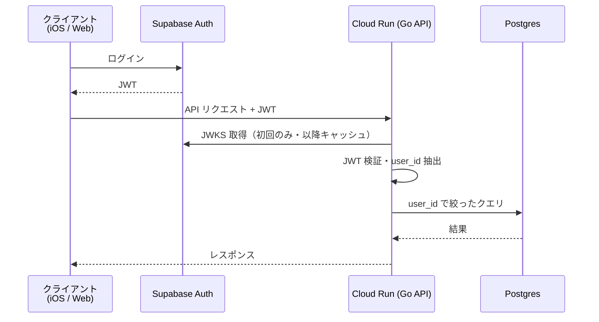
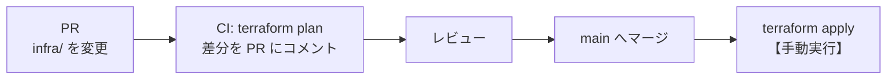

# インフラ設計

- 設計目標: **個人プロジェクトとして、可能な限り無料枠内で運用する**
- 前提: バックエンドは Go（[ADR-0006](adr/0006-go-backend.md)）、API は REST + OpenAPI（[ADR-0007](adr/0007-openapi-schema-driven.md)）

## 1. 全体構成



**API は Cloud Run、データは Supabase、写真は R2、Web は Vercel。** すべて東京リージョン（R2 はグローバル自動配置）。

## 2. 無料枠の罠

**設計レビューで判明した、放置するとサービスが止まる問題。**

### 2.1 Supabase は7日間アクセスがないと自動停止する

Free プランでは**7日間プロジェクトへのアクセスがないと自動で一時停止**され、復旧はダッシュボードからの手動操作になる。

旅行・出張・体調不良で1週間記録が空くと、**次に開いたときサービスが落ちている**。3年計画では確実に起きる。

**対策: GitHub Actions の cron で定期的に疎通させる**（`.github/workflows/keepalive.yml`）。

`/health` は DB に ping を打ってから 200 を返すので、これを叩けば非アクティブ判定を回避できる。

**週1回にはしない。** 閾値が7日なので、1回スキップされただけで超える。月・木の週2回にして、最大の間隔を4日に抑えている。

**GitHub は public リポジトリのスケジュール実行を、60日コミットが無いと自動で無効化する。** 開発が止まっている時期こそ keepalive が要るので、ここが弱点になる。長期間触らない見込みがあるなら、Cloud Scheduler に移す（`docs/05` §7 のバックアップジョブと同じ仕組みで動かせる）。

### 2.2 Cloud Run + Postgres は接続プーラーが必須

Cloud Run は**リクエスト増に応じてインスタンスが増える**。各インスタンスが独立した接続プールを持つため、放置すると接続数が枯渇する。

| 接続方法 | Free tier の上限 |
|---|---|
| 直接接続 | **60** |
| **Supavisor 経由** | **200** |

**対策は3つセットで行う。**

1. **Supavisor の Transaction mode 経由で接続する**（直接接続しない）
2. **Cloud Run の `--max-instances` を制限する**（個人利用なら 5〜10 で十分）
3. **インスタンスあたりのプールサイズを小さく保つ**（`pgxpool` の `MaxConns` を 2〜4）

`max-instances × MaxConns` が上限を超えないことを設計時に確認する。10 × 4 = 40 なら安全。

### 2.3 Artifact Registry は放置すると溢れる

イメージタグに commit SHA を使うため、**デプロイのたびにイメージが増える**。無料枠は 0.5GB で、Go の distroless イメージ（10〜20MB）でも 25〜50 回のデプロイで到達する。

**対策: クリーンアップポリシーで最新5世代のみ保持する。**

```bash
gcloud artifacts repositories set-cleanup-policies physique \
  --location=asia-northeast1 --policy=cleanup-policy.json
```

## 3. コンポーネント選定

| 用途 | 選定 | 無料枠 | 選定理由 |
|---|---|---|---|
| API / MCP | **Cloud Run** (asia-northeast1) | 月200万リクエスト・360,000 GB秒 | コンテナなのでローカルと同一のものが動く。Go の単一バイナリと相性が良い |
| DB | **Supabase Postgres** (Tokyo) | 500 MB | **東京リージョンがある**。Neon はシンガポールでレイテンシが乗る |
| 接続プール | **Supavisor** (Transaction mode) | 200 接続 | §2.2 の通り必須 |
| 認証 | **Supabase Auth** | MAU 50,000 | DB と同じ基盤。自前実装しない |
| 写真 | **Cloudflare R2** ([ADR-0008](adr/0008-r2-photo-storage.md)) | **10 GB・egress 無料** | 原寸のまま6年以上運用できる |
| Web | **Vercel** (Hobby) | 個人利用無料 | Next.js の最短経路。PR ごとのプレビューが自動 |
| エラー監視 | **Sentry** | 5,000 errors/月 | Go / Next.js / Swift すべてに SDK がある |
| CI/CD | **GitHub Actions** | public リポジトリは無制限 | macOS runner（iOSビルド）も無料 |
| iOS 配信 | **TestFlight** | — | **Apple Developer Program 年 $99 が必要**（§4） |

## 4. コスト試算

3年分のデータ量から算出する。

| 項目 | 試算 | 無料枠 | 判定 |
|---|---|---|---|
| DB | 日次1,100行 + セット記録 約25,000行 ≒ **数 MB** | 500 MB | ✓ 余裕 |
| 写真 | 月3枚 × 36ヶ月 × 4MB（原寸）≒ **432 MB** | 10 GB | ✓ 6年でも864MB |
| APIリクエスト | 1日50回 × 365 ≒ **年18,000回** | 月200万 | ✓ 桁違いに余裕 |
| Cloud Run 実行時間 | 1リクエスト200ms × 年18,000 ≒ **1時間/年** | 360,000 GB秒 | ✓ 余裕 |
| Artifact Registry | 最新5世代 × 20MB ≒ **100 MB** | 0.5 GB | ✓（クリーンアップ前提） |
| Cloud Logging | 構造化JSON、低頻度 | 50 GB/月 | ✓ 余裕 |
| Sentry | 個人利用でエラー数十件/月 | 5,000/月 | ✓ 余裕 |
| **Apple Developer Program** | **年 $99** | — | **✗ 有料** |

**想定コスト: 年 $99（月換算 約 $8）。** iOS を配信しない（Web のみで運用する）なら **$0**。

Apple の年会費だけは回避手段がない。無料アカウントでは TestFlight が使えず、実機ビルドも**7日で失効**するため3年運用に耐えない。

## 5. 環境

**local と production の2つだけ。staging は作らない。**

| 環境 | 用途 | DB | 実行 |
|---|---|---|---|
| local | 開発 | **Docker Compose の Postgres（`compose.yaml`）** | `go run` |
| production | 本番（自分が使う） | Supabase | Cloud Run（コンテナ） |

staging を作らない理由は3つ。

1. **利用者が1人**であり、本番を壊しても影響範囲が自分だけ
2. Vercel が **PR ごとにプレビュー環境を自動生成**するため、Web の確認はそこで足りる
3. 環境が増えるとシークレット・マイグレーション・データ整合の管理コストが3倍になる

### ローカル開発環境（Docker）

```bash
docker compose up -d     # Postgres を起動
docker compose down      # 停止
```

**API 本体は開発中 `go run` で動かす**（ビルド時間を挟まないため）。コンテナ化の検証が必要なときだけイメージをビルドする。

### コンテナイメージ

マルチステージビルドで **distroless** を使う。

```dockerfile
FROM golang:1.23 AS build
WORKDIR /src
COPY go.mod go.sum ./
RUN go mod download
COPY . .
RUN CGO_ENABLED=0 go build -trimpath -o /app ./cmd/server

FROM gcr.io/distroless/static-debian12
COPY --from=build /app /app
USER nonroot:nonroot
ENTRYPOINT ["/app"]
```

**distroless を選ぶ理由は3つ。**

1. **イメージが10〜20MB になる。** Cloud Run のコールドスタートが速く、Artifact Registry の容量も節約できる
2. **シェルもパッケージマネージャも含まない**ため、攻撃対象が小さい
3. Go は静的リンクできるため、実行にランタイムが不要

**ローカルと本番で同じイメージが動く**ことが、コンテナを使う最大の利点。「ローカルでは動いた」を構造的に減らせる。

## 6. デプロイフロー（CD）



| 項目 | 決定 | 理由 |
|---|---|---|
| トリガー | **main マージで自動デプロイ** | 利用者が1人でロールバックが容易。承認を挟む意味が薄い |
| 発火条件 | **`paths` フィルタ**（`api/**`, `openapi.yaml`） | ドキュメントや `web/` の変更でデプロイを走らせない |
| 認証 | **Workload Identity 連携** | **サービスアカウントキーをリポジトリに置かない**。GitHub の OIDC から短命トークンを取得する |
| イメージタグ | **commit SHA** | どのコミットが動いているかを一意に特定できる。`latest` は使わない |
| DB マイグレーション | **手動実行（`migrate-db` ワークフロー）** | §7 参照。デプロイとは分離する |
| 手動実行 | `workflow_dispatch` を有効化 | ロールバック後の再デプロイなどに使う |

### ロールバック

Cloud Run は**リビジョンごとにトラフィックを切り替えられる**。

```bash
gcloud run revisions list --service physique-api --region asia-northeast1
gcloud run services update-traffic physique-api \
  --region asia-northeast1 --to-revisions <REVISION>=100
```

**再デプロイではなくトラフィック切り替えなので数秒で戻せる。** マイグレーションを分離しているのはこのため——スキーマが先に進んでいるとコードだけ戻しても動かない。

### Web（Vercel）

| 設定 | 値 |
|---|---|
| Root Directory | `web/` |
| Production Branch | `main` |
| プレビュー | PR ごとに自動生成 |

### iOS（Phase 2 以降）

TestFlight への配信は**タグ push をトリガーにする**（`ios-v*`）。main への毎マージで配信すると審査待ちのビルドが溜まる。

**TestFlight のビルドは90日で失効する**ため、月1回の定期ビルドを `schedule` で回す。App Store への申請は当面行わない（§12）。

### Cloud Run の落とし穴: `/healthz` は使えない

**Google Frontend が `/healthz` ちょうど1つを終端し、コンテナまで届かない**（issue #32）。

```
/healthz    → Google の HTML 404。アプリのログにも残らない
/healthz/   → アプリに到達する
/HEALTHZ    → アプリに到達する
/health     → アプリに到達する
```

Google のインフラは Borg / Kubernetes 由来で `/healthz` を内部のヘルスチェック規約に使っており、そこで吸われていると考えられる。`/readyz` `/livez` `/status` `/ping` は通るので、予約されているのは `/healthz` だけ。

**気づきにくい理由**は2つ。

1. ローカルの `docker run` では再現しない。Cloud Run 固有
2. コンテナは正常に起動し、リビジョンも Ready になる。**他のパスは全部動く**

このプロジェクトでは `/health` を使う。デプロイ後のスモークテストでこれを叩き、200 が返らなければデプロイを失敗扱いにする。

## 7. データベース運用

### 接続

**必ず Supavisor（Transaction mode）経由で接続する**（§2.2）。接続文字列は Secret Manager に置き、Cloud Run の環境変数として注入する。

```
postgres://[user]:[pass]@[project].pooler.supabase.com:6543/postgres
                                                    ^^^^ Transaction mode
```

Transaction mode ではプリペアドステートメントが使えないため、**pgx の `QueryExecModeExec` を指定する**（`api/internal/database/database.go`）。

`QueryExecModeSimpleProtocol` でも動くが、拡張プロトコルを捨てるためバイナリ形式の型変換が効かなくなり、型の扱いが弱くなる。`QueryExecModeExec` は拡張プロトコルを使いつつプリペアドステートメントを接続に残さないので、こちらを採る。

### マイグレーション

**golang-migrate** を使い、SQL ファイルをバージョン管理する。

```
api/migrations/
├── 000001_init.up.sql
├── 000001_init.down.sql
└── ...
```

**適用はデプロイとは分離した手動実行**とする。自動適用にすると、失敗時に「アプリが起動しない」と「スキーマ不整合」が同時に起きて切り分けが難しくなる。

実行は **GitHub Actions の `migrate-db` ワークフロー**（`workflow_dispatch`）から行う。ローカルから流さないのは、接続文字列を手元に平文で置く必要がなくなるため。ワークフローは Workload Identity で認証し、Secret Manager から接続文字列を取る。

```
Actions → migrate-db → Run workflow → command: up
```

**マイグレーションは Session pooler（ポート 5432）を使う。** 理由は2つ。

1. golang-migrate は `pg_advisory_lock` で多重実行を防いでおり、**この lock はセッションスコープ**。Transaction mode（6543）では接続が返却された時点で失われる
2. Supabase の Direct connection（`db.<ref>.supabase.co`）は **IPv6 のみ**で、GitHub Actions の runner は IPv4 しか持たない

接続文字列は Secret Manager に2つ置く。

| Secret | ポート | 用途 |
|---|---|---|
| `supabase-pooler-url` | 6543（transaction） | Cloud Run のアプリ |
| `supabase-session-url` | 5432（session） | マイグレーション |

### バックアップ

| 対象 | 方法 | 頻度 | 実行主体 |
|---|---|---|---|
| Supabase DB | 自動バックアップ | 日次 | Supabase（7日保持） |
| **長期保管** | **CSV エクスポート** | **月次** | **Cloud Scheduler → Cloud Run Jobs（自動）** |
| `private/` 全体 | iCloud Drive 等で同期 | 常時 | — |

**CSV エクスポートは自動化する。** 手動にすると必ず忘れるため、Cloud Scheduler から月次で実行し、R2 に保存する。

**CSV を長期保管の正とする理由**は3つ。Supabase の無料枠が7日保持であること、Go 実装の検証基準（`reference/analysis/`）の入力形式であること（[ADR-0011](adr/0011-go-analytics.md)）、そして**特定のDBにロックインされない形式**であること。

## 8. 認証



- **JWT の検証は Go API 側で行う。** Supabase の JWKS エンドポイントから公開鍵を取得し、**プロセス内にキャッシュする**（毎リクエスト取得しない）
- **Service Role Key をクライアントに渡さない。** iOS のバイナリは解析できるため、特権キーを埋め込まない
- 認可は `user_id` による絞り込みで行う。R2 は RLS が使えないため、**API が所有者を検証してから署名付きURLを発行する**（[ADR-0008](adr/0008-r2-photo-storage.md)）

## 9. Infrastructure as Code（Terraform）

インフラは Terraform で管理する（[ADR-0012](adr/0012-terraform.md)）。**Apple 以外は全サービスにプロバイダが存在する。**

| プロバイダ | 管理対象 | 状態 |
|---|---|---|
| `hashicorp/google` | Cloud Run、Artifact Registry、Secret Manager（箱のみ）、Cloud Scheduler、Workload Identity、IAM | 公式 |
| `supabase/supabase` | プロジェクト設定 | 公式 |
| `cloudflare/cloudflare` | R2 バケット、CORS | 公式 |
| `vercel/vercel` | プロジェクト設定、環境変数 | 公式（Verified） |
| `jianyuan/sentry` | プロジェクト、アラートルール | コミュニティ製（Sentry 公式スポンサー） |
| `integrations/github` | ブランチ保護、Actions Secrets（箱のみ） | 公式パートナー |
| — | **Apple Developer / TestFlight** | **プロバイダなし。fastlane または手動** |

### ディレクトリ構成

```
infra/
├── backend.tf        GCS バケットに state を置く（バージョニング有効）
├── providers.tf      プロバイダ定義とバージョン固定
├── variables.tf
├── gcp.tf            Cloud Run / Artifact Registry / Secret Manager / Scheduler / IAM
├── cloudflare.tf     R2 バケット
├── vercel.tf         プロジェクト設定・環境変数
├── github.tf         ブランチ保護・Actions Secrets
├── sentry.tf         プロジェクト・アラート
└── outputs.tf
```

### シークレットは state に入れない

**Terraform の state はシークレットを平文で保存する。** 暗号化バックエンドを使っても `terraform show` で読めるため、**Secret Manager には「箱」だけを作り、値は別途投入する**。

```hcl
resource "google_secret_manager_secret" "db_url" {
  secret_id = "supabase-pooler-url"
  replication { auto {} }
}
# google_secret_manager_secret_version は Terraform で管理しない
```

```bash
echo -n "$POOLER_URL" | gcloud secrets versions add supabase-pooler-url --data-file=-
```

### 管理しないもの

| 対象 | 代わりに |
|---|---|
| シークレットの値 | 手動投入（上記） |
| **DB スキーマ** | `golang-migrate`（§7）。Terraform はテーブル定義の管理に向かない |
| Supabase プロジェクト本体 | コンソールで手動作成（Free tier は2プロジェクトまでで作り直しが起きない） |
| Apple Developer 関連 | fastlane / 手動 |

### 適用フロー



**`apply` は手動。** インフラ変更の頻度が低く、1人開発で state のロック競合が起きないため、自動適用する必要がない。ただし **`plan` は CI で実行して PR に差分を出す**——インフラ変更の影響をマージ前にレビューできるようにするため。

## 10. シークレット管理

**3箇所に分散するため、一覧を本ドキュメントで管理する。**

| 置き場所 | 内容 |
|---|---|
| **Google Secret Manager** | Supabase 接続文字列（Supavisor / 直接の2種）、Supabase JWT Secret、R2 アクセスキー、Sentry DSN |
| **GitHub Secrets** | `WIF_PROVIDER`、`WIF_SERVICE_ACCOUNT`、`GCP_PROJECT_ID`、`API_HEALTHZ_URL`、iOS 証明書・プロファイル・App Store Connect API キー |
| **Vercel 環境変数** | Supabase URL / Anon Key、API のエンドポイント、Sentry DSN |
| ローカル `.env`（gitignore） | 開発用の値 |

**リポジトリにシークレットを置かない。** `.gitignore` に `.env*` を含めている。

## 11. 監視と可観測性

| レイヤー | ツール | 見るもの |
|---|---|---|
| エラー | **Sentry** | 例外・スタックトレース・発生頻度。リリース単位で追跡 |
| ログ | **Cloud Logging** | Cloud Run の標準出力（`log/slog` で構造化JSON） |
| メトリクス | Cloud Run 標準 | リクエスト数・レイテンシ・エラー率・コールドスタート |
| 死活監視 | `/health` | DB 接続を含む疎通確認。§2.1 の keepalive も兼ねる |
| **記録の停止検知** | **Cloud Monitoring アラート** | **24時間以上「記録の書き込みがない」場合に通知** |

### なぜ「記録の停止検知」が要るか

**Sentry はエラーが出たときしか教えてくれない。** しかし3年計画で最も怖いのは、**エラーも出さずに記録が止まること**である。

- 同期が静かに失敗し続けている
- 単に記録を忘れている

どちらも「エラーなし・データなし」として現れるため、能動的に検知しないと気づけない。**分析基盤が「記録漏れ」を検知する仕組み（[03-分析ロジック.md](03-分析ロジック.md)）のインフラ版**にあたる。

**個人プロジェクトに Datadog は導入しない。** 無料枠が「5ホスト・1日保持」で実用性が低く、必要な情報は Cloud Logging と Sentry で足りる。

## 12. セキュリティ

| | 方針 |
|---|---|
| 認証 | Supabase Auth。JWT を API で検証（§8） |
| 認可 | `user_id` による絞り込み。R2 は API が所有者検証して署名付きURL発行 |
| CORS | Vercel のドメインのみ許可 |
| 通信 | HTTPS のみ（Cloud Run / Vercel ともデフォルト） |
| 写真 | 公開URLを発行しない。**短期の署名付きURL**でのみ配信 |
| 個人データ | リポジトリに含めない（[ADR-0002](adr/0002-separate-personal-data.md)） |
| シークレット | Secret Manager。**サービスアカウントキーを発行しない**（Workload Identity）。**Terraform state に値を入れない**（§9） |

**扱うのは体組成・身体写真・血液検査結果**であり、センシティブな個人データにあたる。利用者が1人でも、認証と権限分離は最初から入れる。

## 13. 障害時の対応

| 障害 | 影響 | 対応 |
|---|---|---|
| **Supabase が7日非アクティブで停止** | API が全断 | ダッシュボードから復旧。**keepalive で予防する**（§2.1） |
| API が落ちる | 記録の同期が止まる | **iOS はローカルDBを正とするため記録は継続できる**。復旧後に同期 |
| DB が落ちる | 同上 | Supabase の復旧を待つ。CSV バックアップから再構築可能 |
| 接続数の枯渇 | 一部リクエストが失敗 | `--max-instances` を下げる。Supavisor 経由か確認（§2.2） |
| Cloud Run のデプロイ失敗 | API が旧バージョンのまま | 前リビジョンにトラフィックを戻す（§6） |
| Supabase 無料枠の終了・仕様変更 | サービス継続不可 | **CSV エクスポートがあれば別基盤へ移行できる** |
| R2 の仕様変更 | 写真の配信不可 | S3互換APIのため、他のS3互換ストレージへ移行できる |

**オフライン優先の設計が、そのまま障害耐性になっている。** ジムの電波対策として入れた仕組みが、API障害時にも効く。

## 14. 未決事項

| 項目 | 内容 |
|---|---|
| Cloud Run の最小インスタンス数 | 0 だとコールドスタート（1〜2秒）が発生する。無料枠を優先して 0 とするか、体験を優先して 1 にするか（有料化する） |
| 写真のリサイズ | 原寸で保存する方針だが、アップロード時にクライアント側で向き補正だけするか |
| iOS の配信 | TestFlight のみか、App Store 申請まで行うか。年 $99 を払うタイミング |
| keepalive の頻度 | 週1回で足りるか、念のため3日ごとにするか |
| **認証方式** | Supabase Auth のどれを使うか。メール+パスワード / マジックリンク / OAuth(GitHub)。1人利用なので何でもよいが未決 |
| **API のバージョニング** | `/v1/` を付けるか。破壊的変更の頻度が低ければ不要かもしれない |
| **ログの個人データ** | 構造化ログに体重・体脂肪率を出さない方針。マスキングをどこで行うか |
